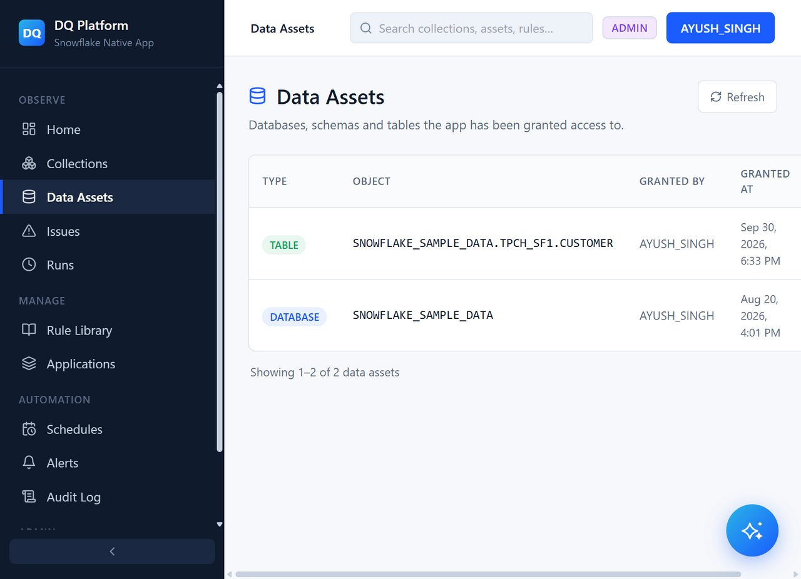

# Step 2: Discovering & Managing Data Assets

Once table references are granted in Snowsight, **Artha DataTrust** automatically surfaces those tables and columns in the **Data Assets** catalog.

---

## 1. Open the Data Assets View

1. Open the Artha DataTrust application interface.
2. In the left navigation sidebar under **Observe**, click **Data Assets**.

The Data Assets screen provides an inventory of all tables and views accessible to the Native App.

---

## 2. Inspect Table Schema and Metadata

In the Data Assets table, you will see your registered table:
- **Source**: `SNOWFLAKE_SAMPLE_DATA`
- **Schema**: `TPCH_SF1`
- **Table Name**: `CUSTOMER`
- **Rows**: `150,000`
- **Columns**: `8`
- **Quality Status**: Tracks total rules bound, pass rates, and active issues.

Clicking on the `CUSTOMER` asset opens a detailed schema view displaying all available columns:
- `C_CUSTKEY` (NUMBER)
- `C_NAME` (VARCHAR)
- `C_ADDRESS` (VARCHAR)
- `C_NATIONKEY` (NUMBER)
- `C_PHONE` (VARCHAR)
- `C_ACCTBAL` (NUMBER) — *Target column for our data quality rules*
- `C_MKTSEGMENT` (VARCHAR)
- `C_COMMENT` (VARCHAR)

---

## Next Steps

Next, proceed to **[Step 3: Users, Roles & Teams](03-users-and-teams.md)** to invite team members and configure role-based access control inside Artha DataTrust.
