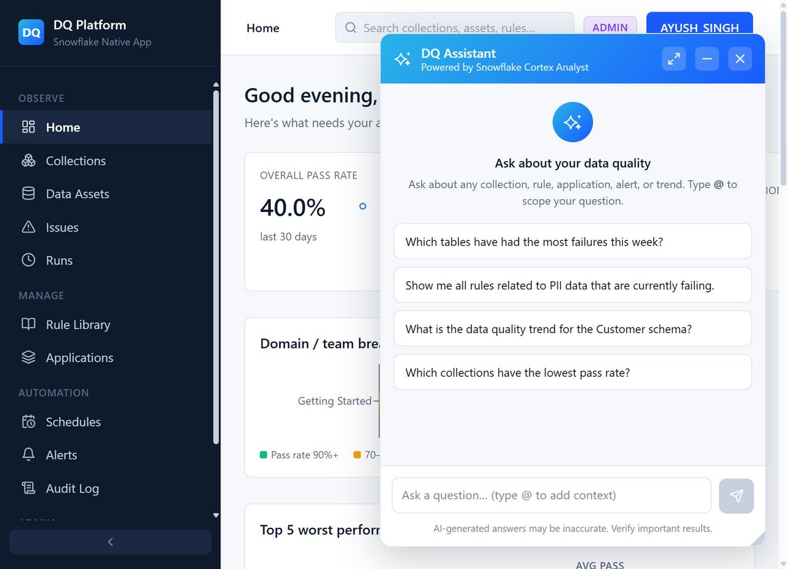

# Step 5: Executing Runs, Inspecting Issues & Ask DQ Assistant

This final tutorial step covers running your quality checks, inspecting results and triage issues, and leveraging the built-in Cortex AI Assistant.

---

## 1. Triggering an Execution Run

1. Navigate to **Collections** in the sidebar.
2. Select your collection (e.g. **Getting Started - SNOWFLAKE_SAMPLE_DATA**).
3. Click **Run now** in the top action bar.

4. The execution engine evaluates all active rule applications against your target tables using Snowflake compute.

---

## 2. Viewing Results & Issues

1. In the sidebar under **Observe**, click **Runs** to view execution logs, run durations, total checks evaluated, pass rates, and failure breakdowns.
2. Click **Issues** to see any records violating your defined rules:
   - Identifies failed rule name and severity.
   - Shows target table and column (e.g. `CUSTOMER.C_ACCTBAL`).
   - Displays failed row count and sample offending records.
   - Allows assigning issues to team members (e.g., `DataGovernance`) or setting status (`OPEN`, `INVESTIGATING`, `RESOLVED`).

---

## 3. Interacting with "Ask the DQ Assistant"

Artha DataTrust includes a built-in AI chatbot backed by Snowflake Cortex AI that answers natural language questions about your data quality posture.

1. Click the floating **Ask the DQ Assistant** widget in the bottom right corner of any page.
2. You can type custom natural language queries or click one of the suggested prompts:
   - *"Which tables have had the most failures this week?"*
   - *"Show me all rules related to PII data that are currently failing."*
   - *"What is the data quality trend for the Customer schema?"*
   - *"Which collections have the lowest pass rate?"*

3. The assistant queries historical execution results, rule metadata, and active issues to provide conversational answers with actionable context.

---

## Conclusion & Summary

You have completed the full end-to-end journey of **Artha DataTrust**:
1. Installed the application and granted table permissions via the Snowsight Permissions UI.
2. Verified data asset discovery in the catalog.
3. Created user roles and organized teams for governance.
4. Bound pre-built system rules to target tables and columns.
5. Executed data quality runs, reviewed issues, and queried the Cortex AI Assistant.
