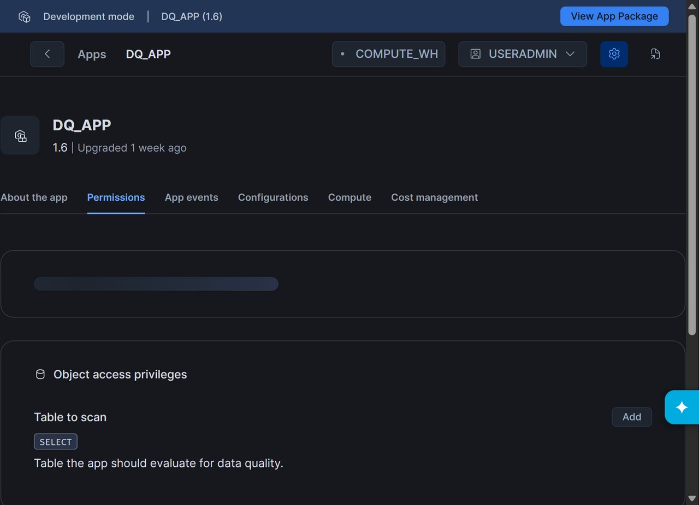
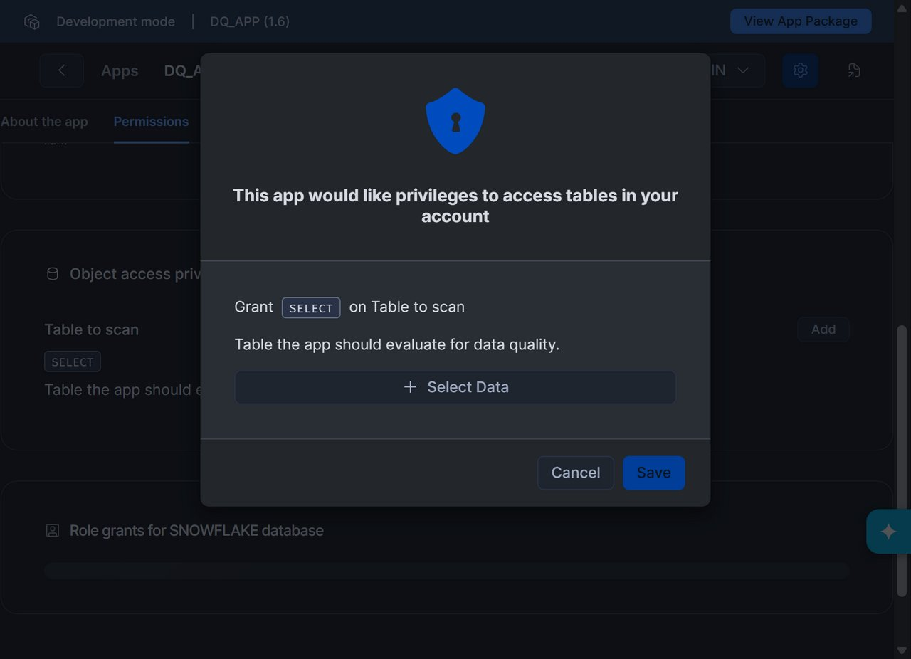
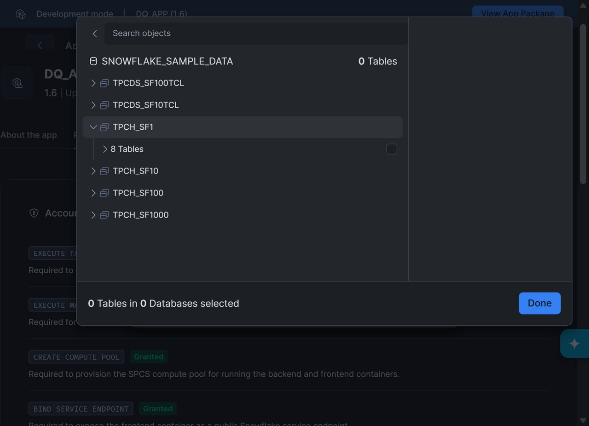
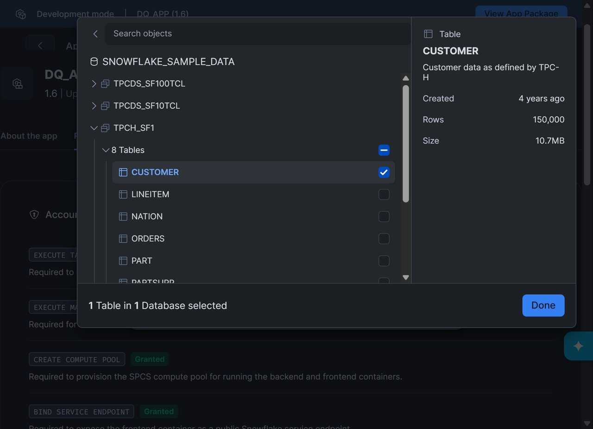
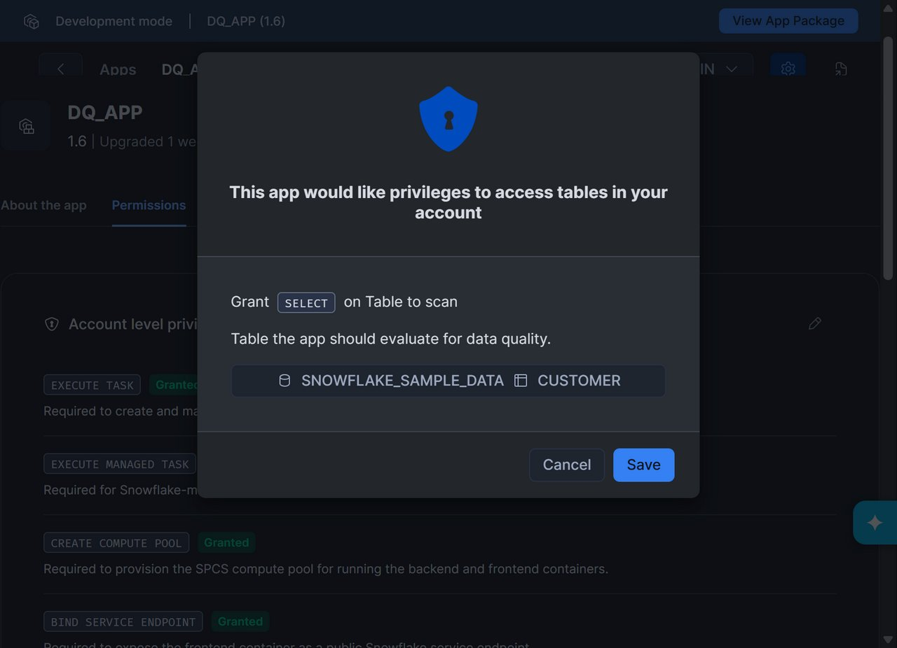
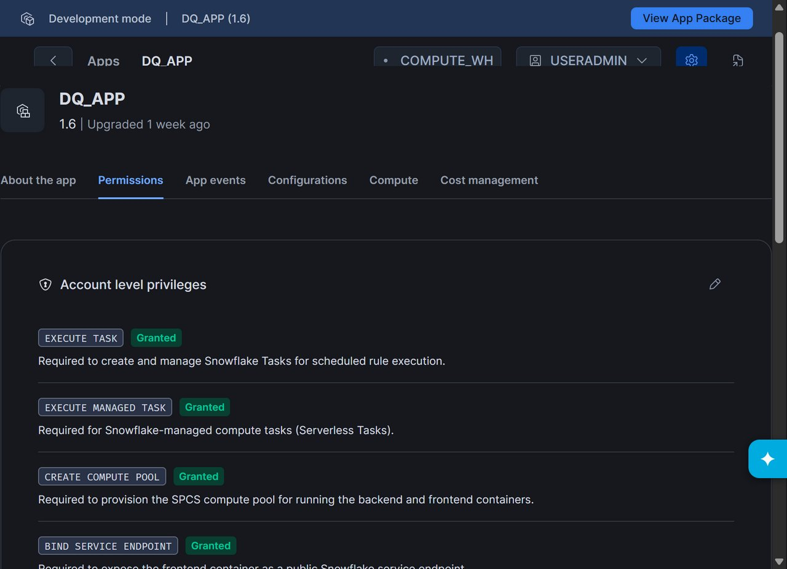

# Step 1: Installation & Table Access Grants

This step covers getting started with **Artha DataTrust** from the Snowflake Marketplace and granting table access through the Snowsight user interface.

---

## 1. Install Artha DataTrust from Marketplace

1. Navigate to **Snowflake Marketplace** in the Snowsight navigation sidebar.
2. Search for **Artha DataTrust** and click **Get**.
3. Select your desired Snowflake warehouse (e.g., `DQ_WH` or a general purpose compute warehouse) and click **Get**.

Once installed, Artha DataTrust appears under **Data Products** -> **Apps** in Snowsight.

---

## 2. Navigate to App Permissions

Before Artha DataTrust can scan and evaluate your data, you must grant it read permissions on target tables. Snowflake Native Apps use the **Permissions SDK Reference Model**, allowing you to grant access securely through the Snowsight UI without writing SQL commands.

1. In Snowsight, open **Data Products** > **Apps** and select **Artha DataTrust** (or `DQ_APP`).
2. Click the **Permissions** tab at the top of the app details page.

Under **Required Privileges & Object References**, you will find the `CONSUMER_TABLE_REF` entry labeled **"Table to scan"** with status **Pending**.

---

## 3. Grant Table Access via Object Picker

1. Click **+ Add** (or **Review**) next to **Table to scan**.
2. An **Add Reference** dialog appears.

3. Use the database object hierarchy tree to browse your database and schema. For this tutorial, we will use the sample TPCH dataset:
   - Expand **`SNOWFLAKE_SAMPLE_DATA`**
   - Expand **`TPCH_SF1`**

4. Select the **`CUSTOMER`** table. Snowsight displays table metadata including row count (~150,000 rows) and table type.

5. Click **Done**.
6. Review the confirmation dialog summarizing the grant (`SELECT` on `SNOWFLAKE_SAMPLE_DATA.TPCH_SF1.CUSTOMER`).

7. Click **Grant**.

---

## 4. Verify Active Reference

The Permissions tab updates immediately:
- **`CONSUMER_TABLE_REF`** changes status to **Active / Granted**.
- The bound object `SNOWFLAKE_SAMPLE_DATA.TPCH_SF1.CUSTOMER` is registered with the application.

---

## Next Steps

Now that table permissions are granted, proceed to **[Step 2: Data Assets](02-data-assets)** to verify asset discovery in the Artha DataTrust interface.
