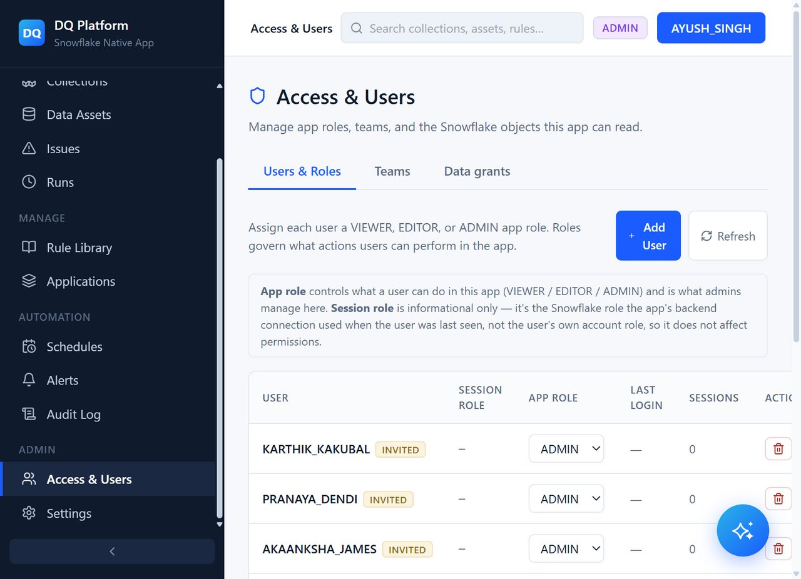
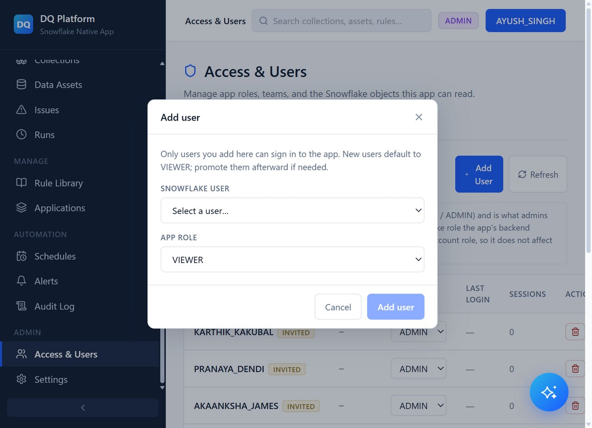
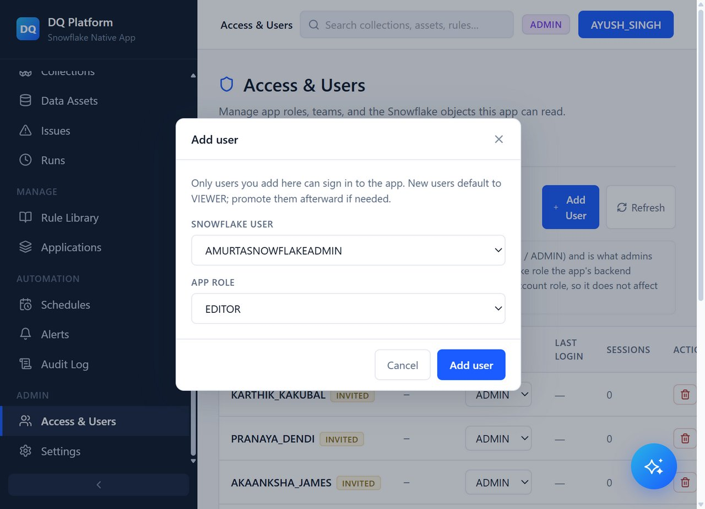
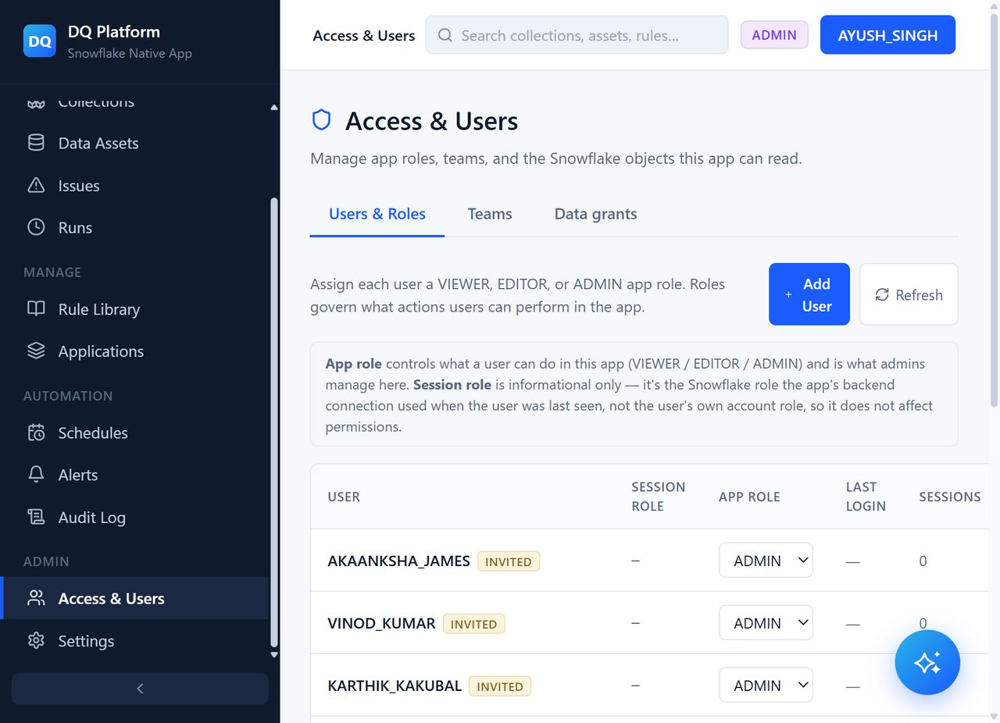
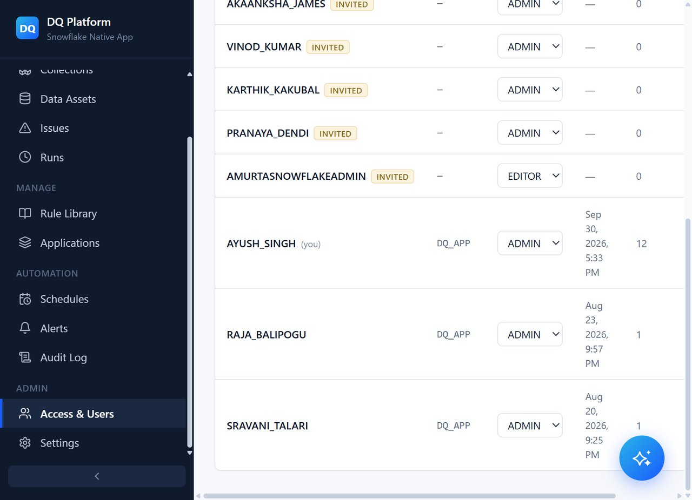
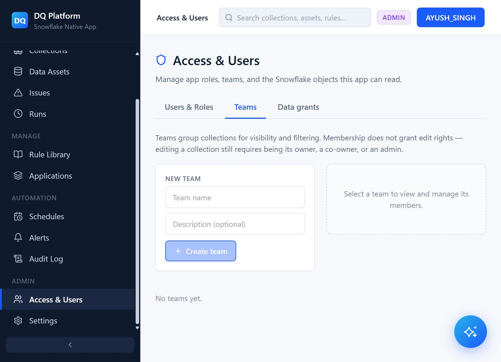
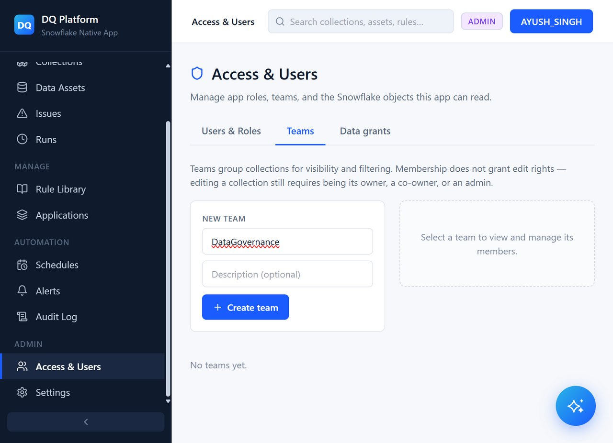
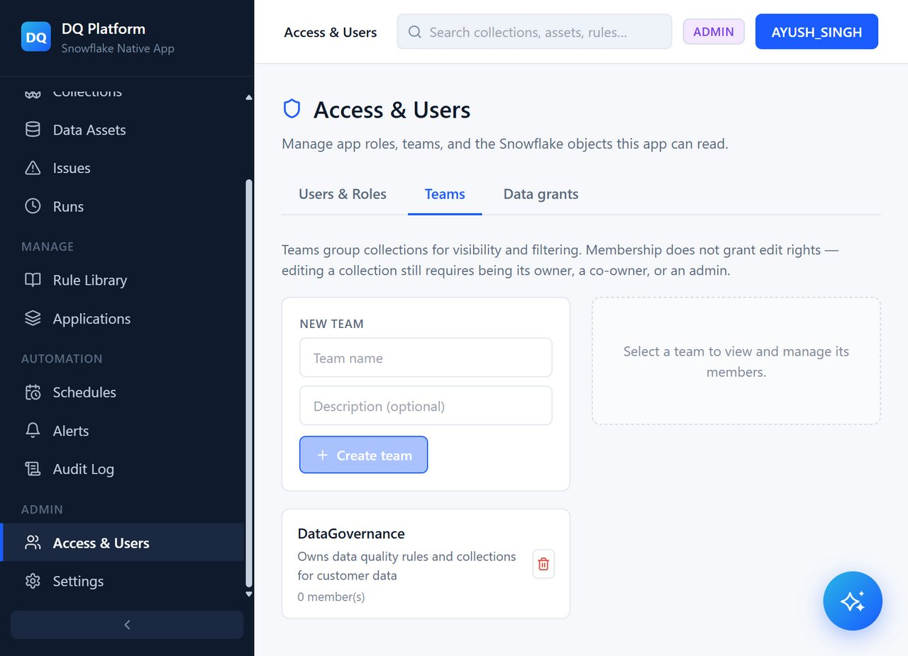
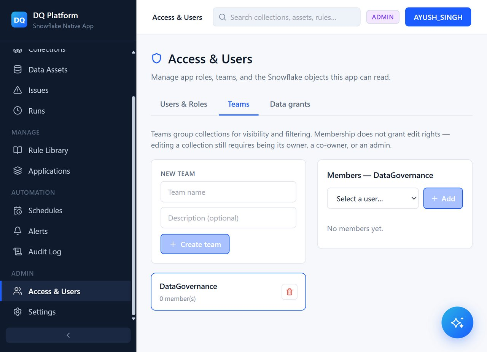
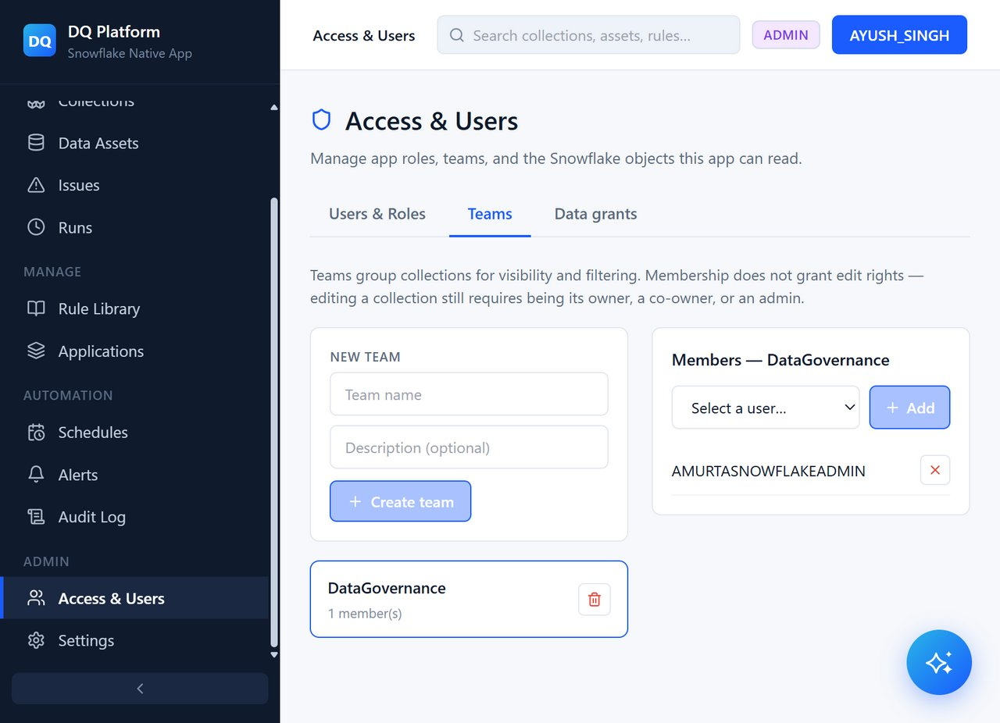

# Step 3: Users, Roles & Teams Management

Artha DataTrust includes built-in Role-Based Access Control (RBAC) and team grouping to ensure data governance policies and check definitions are managed by authorized personnel.

---

## 1. Access the Users & Access Page

1. In the left navigation menu under **Manage**, click **Access & Users**.
2. The default **Users** tab displays current application users, assigned roles, and active status.

---

## 2. Invite a New User

1. Click the **+ Add user** button in the top right.
2. The **Add user** modal opens.

3. Fill in the user details:
   - **Snowflake User / Email**: `AMURTASNOWFLAKEADMIN` (or the Snowflake username / email of your colleague)
   - **Role**: Select **Editor** (options include `ADMIN`, `EDITOR`, `VIEWER`)

4. Click **Add user**.
5. A confirmation message confirms that the user was added successfully.

The user list refreshes to show `AMURTASNOWFLAKEADMIN` with the `EDITOR` role and active status.

---

## 3. Create a Data Governance Team

Teams allow organizing users and scoping notification alerts and issue ownership.

1. Switch to the **Teams** tab on the **Access & Users** page.

2. Fill out the **Create team** form:
   - **Name**: `DataGovernance`
   - **Description**: `Governance & Quality Team for Customer Datasets`

3. Click **Create team**.
4. The new team card appears in the Teams list.

---

## 4. Add Members to the Team

1. Select the **DataGovernance** team card to open the **Members — DataGovernance** side drawer.
2. Under **Add member**, select `AMURTASNOWFLAKEADMIN` from the user dropdown.

3. Click **Add to team**.
4. The team drawer updates showing `AMURTASNOWFLAKEADMIN` as an active member of `DataGovernance`.

---

## Next Steps

Proceed to **[Step 4: Rule Library & Collections](04-rule-library-and-collections)** to browse pre-built rules and bind them to your tables.
