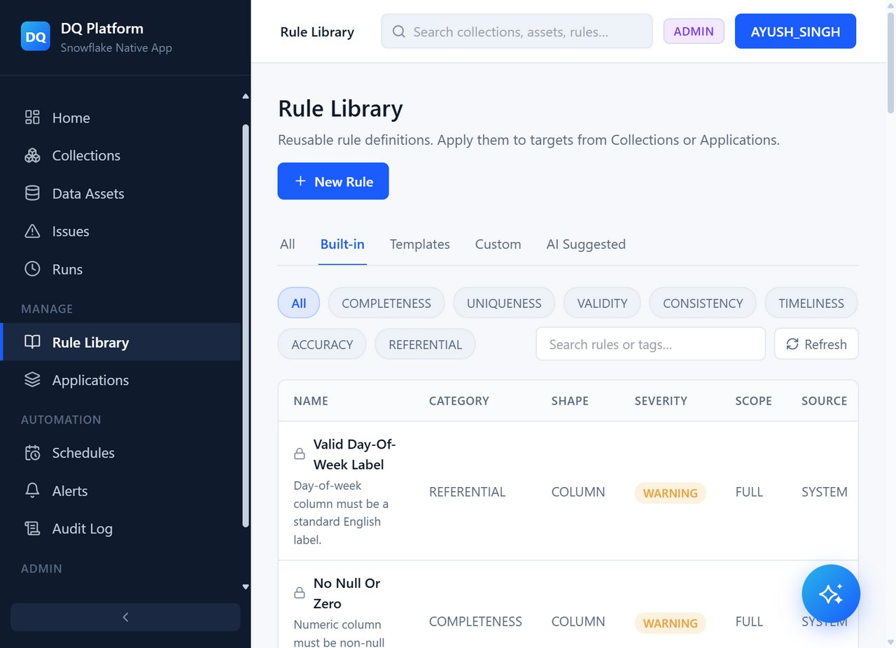
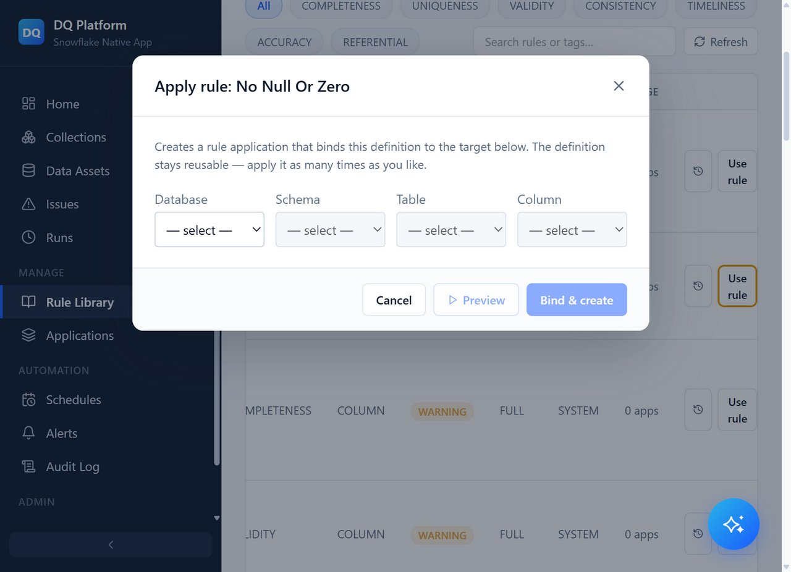
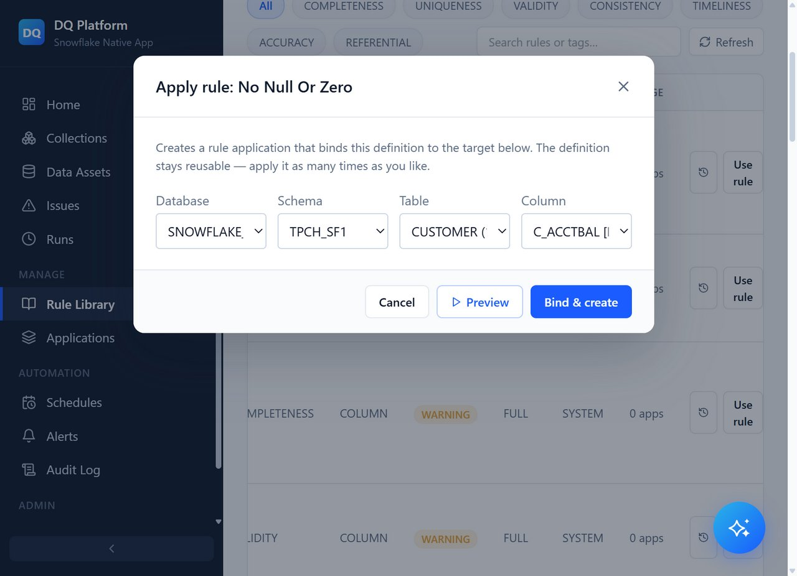
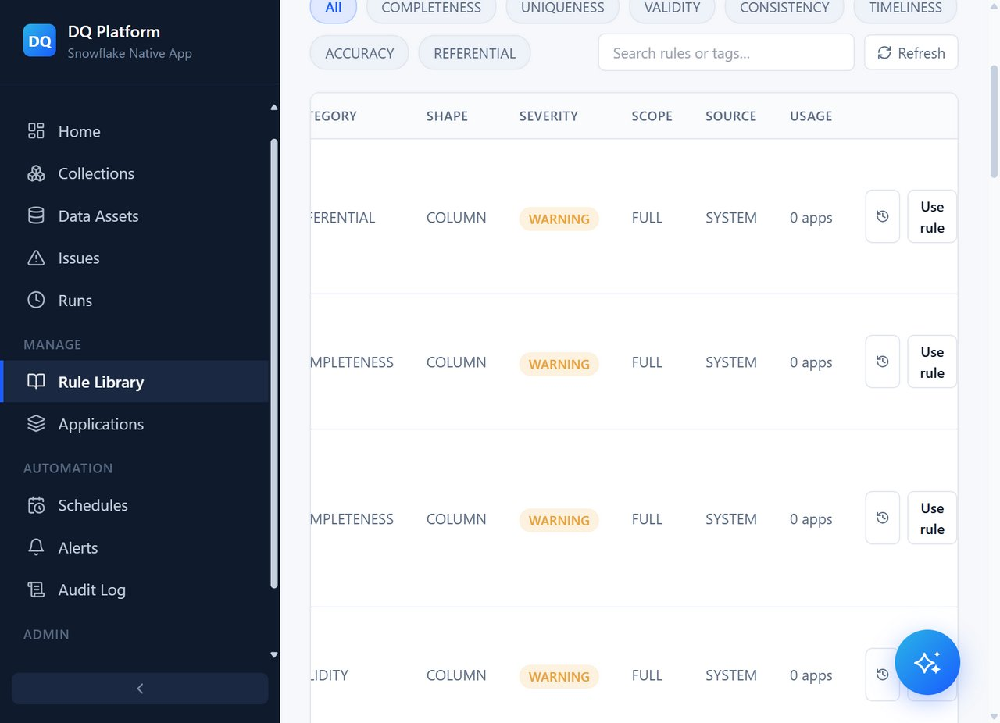
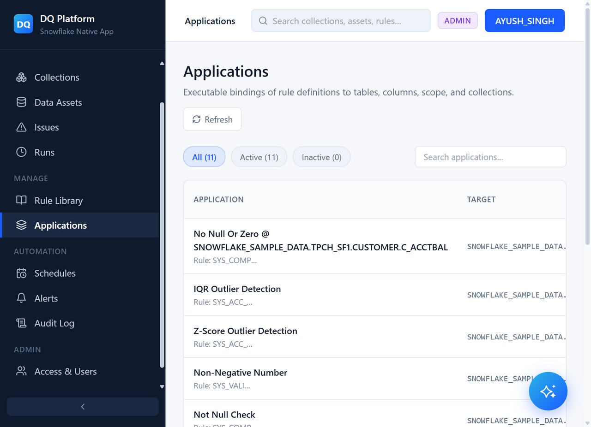
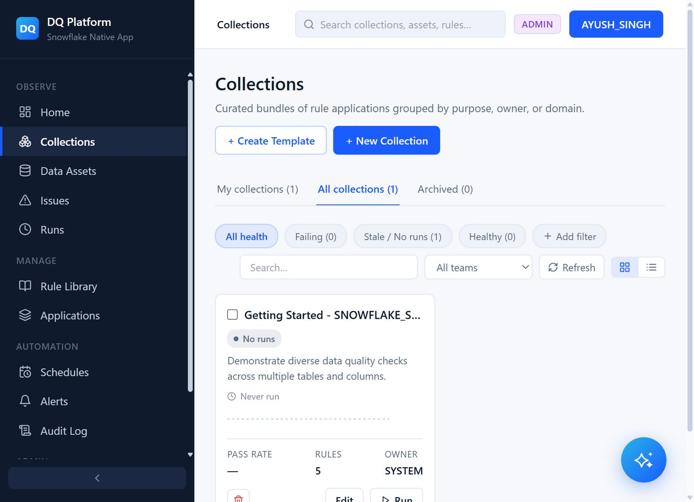
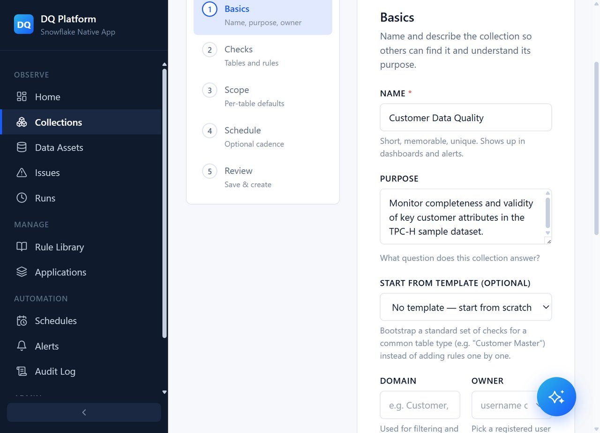
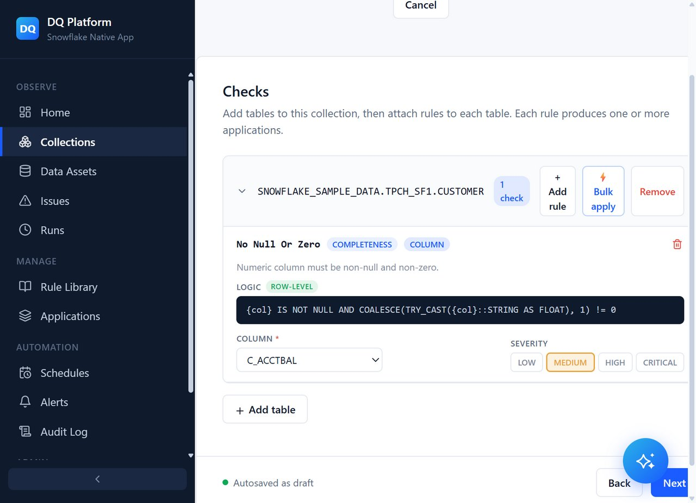
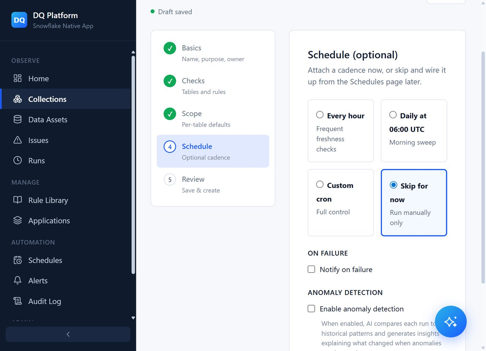
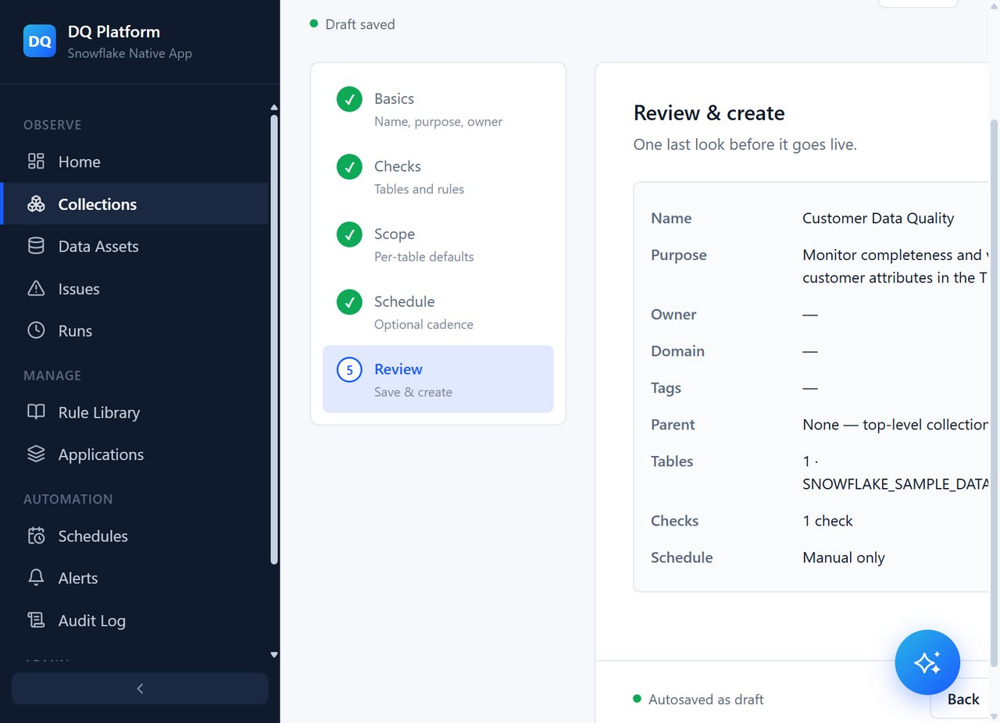

# Step 4: Rule Library, Rule Binding & Collections

Artha DataTrust provides 40+ pre-built, production-ready system rules across Completeness, Accuracy, Validity, Consistency, and Uniqueness. You can bind these rules directly to your tables or group them into scheduled execution Collections.

---

## 1. Browse the Rule Library

1. In the left navigation menu under **Manage**, click **Rule Library**.
2. The Rule Library catalog displays system-provided and custom rules with tags for category, severity, and supported data types.

Key built-in rules include:
- **No Null Or Zero**: Ensures values are non-null and strictly greater than zero.
- **Valid Email Format**: Checks regex pattern conformity for email addresses.
- **Positive Numeric Value**: Ensures numeric metrics do not contain negative values.
- **Unique Identifier**: Verifies primary key uniqueness.

---

## 2. Apply a Rule to a Column

1. Locate the **No Null Or Zero** rule card and click **Apply Rule** (or click the rule card to open the action panel).
2. The **Apply rule: No Null Or Zero** drawer opens on the right.

3. Configure the target data asset:
   - **Database**: `SNOWFLAKE_SAMPLE_DATA`
   - **Schema**: `TPCH_SF1`
   - **Table**: `CUSTOMER`
   - **Column**: `C_ACCTBAL`
   - **Severity**: `High` / `Error`

4. Click **Apply to target**.
5. A confirmation notification confirms that the rule application has been created.

---

## 3. Review Active Rule Applications

1. In the left sidebar, click **Applications**.
2. The Applications view lists all active rule bindings across your tables and columns, displaying status, target columns, and last evaluated results.

---

## 4. Collections Workflow

Collections allow grouping multiple data quality checks across multiple tables into a single logical pipeline that can be scheduled or triggered on demand.

1. In the left sidebar under **Observe**, click **Collections**.

2. The Collections dashboard displays existing collections, such as the pre-configured **Getting Started - SNOWFLAKE_SAMPLE_DATA** suite.
3. Clicking **+ New Collection** launches the 4-step Collection Wizard:
   - **Step 1: Basics** — Collection name, description, and target environment.
   - **Step 2: Checks** — Select tables and attach rules to specific columns.
   - **Step 3: Schedule** — Set execution schedule (e.g. Daily, Hourly, or On-Demand).
   - **Step 4: Review** — Final summary and activation.

---

## Next Steps

Proceed to **[Step 5: Executing Runs & AI Assistant](05-running-and-chatbot)** to execute validation checks, inspect issue results, and query the assistant.
